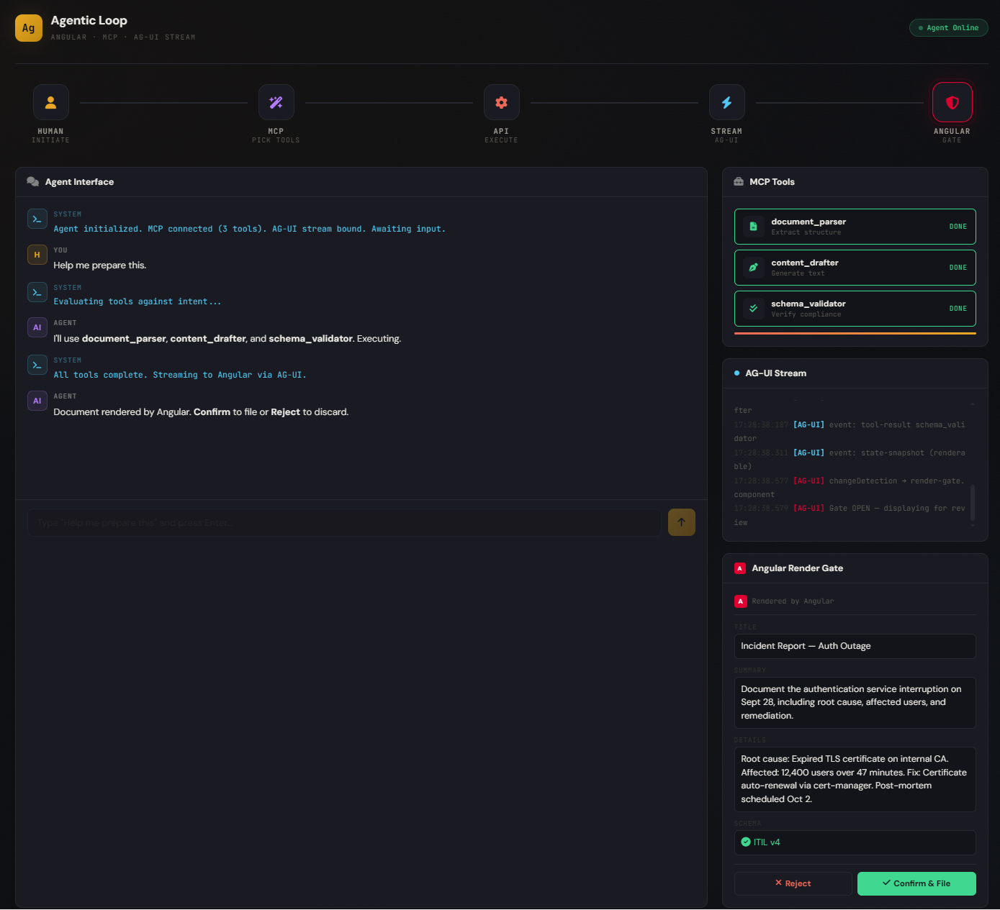
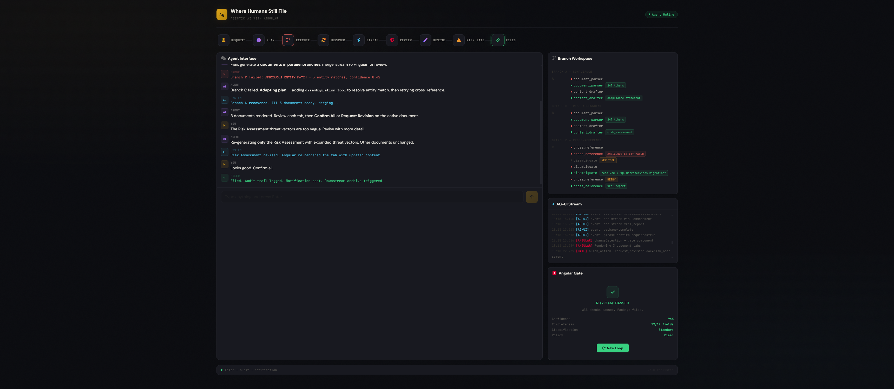

# 🤖 Workshop: `Agentic AI with Angular`: Where Humans Still File

## 🚀 DEMO 1


### 🎛️ Demo signal key
- 🙋 Human request
- 🧠 Agent planning
- 🛠️ Backend tools
- ⚡ AG-UI stream
- 🅰️ Angular render gate
- 🛡️ Risk evaluation
- ✅ Filed · ⛔ Blocked · 🚫 Refused

```bash
// DEMO 1
// terminal
python server.py
```

## 💡 What is this demo
- Test to explain the concept to a team, client, or stakeholder — this is excellent. They can see the flow, touch it, and understand their role in the loop
- A prototype the UX before building the real thing — this shows exactly what the Angular gate should feel like
- A presentation artifact — drop this in a browser during a talk and it's more compelling than any slide deck
- A production code? Absolutely not. This is a communication tool, not a system

> Think of it as an interactive architecture diagram. It shows where every wire goes and what happens at each junction. But the wires are drawn on paper, not carrying real signals.

## 🚧 What this demo is NOT
This is a wired mockup, not a working system. Here's what's fake:
- No real LLM — the "planning" step is just a timer, not an actual model call
- No real MCP server — tools don't parse or draft anything, the text is hardcoded
- No real AG-UI stream — there's no WebSocket or SSE connection, log lines are scripted
- No real risk gate — it just cycles pass/block/refuse on a counter, no actual confidence scoring
- No real Angular — this is vanilla JS in a single HTML file, not an actual Angular app with components, services, change detection, RxJS

## 🧭 What a real version needs
To make this an actual working system:
```ts
Frontend (Angular)              Backend
┌─────────────────┐            ┌──────────────────┐
│ ChatComponent   │◄──SSE────►│ AG-UI Stream      │
│ GateComponent   │            │   handler         │
│ PlanComponent   │            ├──────────────────┤
│                 │──POST────►│ Agent Orchestrator│
│ RxJS streams    │            │   (LangChain /    │
│ ChangeDetection │            │    CrewAI / etc)  │
│ Zone.js         │            ├──────────────────┤
└─────────────────┘            │ MCP Server        │
                               │   ├─ parser tool  │
                               │   ├─ drafter tool │
                               │   └─ validator    │
                               ├──────────────────┤
                               │ Risk Gate Service │
                               │   ├─ confidence   │
                               │   ├─ completeness │
                               │   └─ policy check │
                               └──────────────────┘
```

> We'd need: an actual Angular project with components, an AG-UI stream handler (the real protocol uses Server-Sent Events with specific event types), a real MCP server (the Model Context Protocol is an open spec), an LLM orchestrator, and a risk evaluation service.

## 🔭 DEMO 2




```bash
// DEMO 2
// terminal
python server.py
``` 

## A more realistic
The previous one was a straight line — no failures, no parallel tracks, no recovery, no partial fixes. Real agents don't work like that.

Parallel branches that actually fail. Three branches execute simultaneously in the workspace panel. Branch C hits a real error — AMBIGUOUS_ENTITY_MATCH with a confidence score of 0.42. The trace icon shakes red. You see the failure happen.

The agent adapts. It doesn't restart from scratch. It reasons about the failure, adds a disambiguation_tool to its plan (marked with an orange "NEW TOOL" tag), runs it, resolves the entity, and retries only the failed branch. This is what real agents do — they observe, reason, and patch.

Partial revision, not full restart. After all three documents render in tabs, the human flags an issue with just the Risk Assessment. The agent re-generates only that one document. The other two tabs are untouched. The revised tab gets an orange dot indicator. This is the difference between a toy and a tool.

The risk gate has actual metrics. Instead of a single pass/fail, it shows four evaluation criteria — confidence score, completeness, classification, and policy check — each with its own color. You can see why it blocked (67% confidence, missing sign-off) or why it refused (31% confidence, unverified source).

Dynamic execution trace. The top bar isn't fixed — it grows step by step. The "Recover" and "Revise" steps only appear when triggered. If nothing fails, they wouldn't be there. The trace is a real record of what actually happened, not a predetermined path.

Post-filing hooks. On pass: audit trail ID, email notification, downstream webhook. On block: revision queued to a specific person. On refuse: auto-incident created with a number. Real systems have downstream effects — this shows them.

---

## 🧱 The 3 Core Technical Layers

1. 🧠 `Reasoning Engine (LLM that decides)` = LLM (Agent/Composer)
 - Plans, chooses actions, interprets results, produces output
 - Patterns: ReAct (reason + act), chain-of-thought, plan-then-execute
 - Host can be any agent platform or custom wrapper — not the tools themselves

2. 🛠️ `The Empowerment Stack (The Tools, managed by the Code)` = MCP/RAG tools (+ Shell/Read/Edit, skills)
 - APIs, RAG/search, code execution, browsers, MCP/functions, etc.
 - How the agent gets external truth and acts on the world

3. ⚙️ `The State & Runtime Manager (The Prompt + The Orchestration Code & Execution Guardrails)` = chat/runtime + project rules/prompts (lanes, Modular RAG, agent-prompt-*.md, TODO/DONE)1
 - Translates fuzzy project rules (`.rules`, `agent-prompt-*.md`) into rigid runtime constraints.
 - Dictates allowed execution lanes and manages the step-by-step progress checklist (TODO/DONE).
 - Formats and injects the dynamic payload context into the Reasoning Engine before execution.
 - Standardises how tool-call outputs are fed back into the context window.

---

## 🏗️ Agentic AI System Architecture

> Agentic AI system architecture shifts AI from a passive, single-turn text predictor into an autonomous execution engine. It wraps an LLM 'brain' inside a software runtime that allows it to independently Plan, execute code or APIs, evaluate the results, and iterate until a target engineering goal is completely met.

> A human states intent. An agent plans. The backend does the work. Angular shows it. A risk gate decides if a write is allowed. A human still files.

### 🔄 What Happens at Each Step
1. 👤 You — Your message appears in the chat. That's it. You're done for now.

2. 🧠 The Agent thinks — A purple "brain" icon lights up. On the right side, a list appears showing the agent's plan — like a to-do list checking off items one by one. It's figuring out what tools it needs before it touches anything.

3. 🔧 The Backend works — Three tool cards on the right light up: a parser reads the raw data, a drafter writes the document, a validator checks it's correct. Each one spins while running, turns green when done. A progress bar fills up. This part is deterministic — no guessing, just execution.

4. 📡 The Stream — Tiny log lines appear showing data traveling from the backend to your screen. Think of it like a delivery tracker: "package left warehouse," "package in transit," "package arrived."

5. 🖥️ Angular shows you the result — A document appears in the bottom-right card. The text types itself out letter by letter with a blinking cursor. While it's typing, the Confirm and Reject buttons are greyed out — you can't click them yet. This is the gate. Angular won't let you act until it's fully rendered. Once typing finishes, buttons light up. You must choose.

6. 🚦 The Risk Gate — This is the new part. After you click Confirm, the document doesn't just file. It goes to one more checkpoint on the backend that decides:

- ✅ Green — Pass: Everything looks good. Confidence is high. Document is filed. You see a green checkmark.
- ⚠️ Orange — Block: Something's wrong. Maybe a required signature is missing, or the system isn't confident enough (like 62% when it needs 85%). It tells you exactly why and sends the document back. Nothing gets filed.
- ⛔ Red — Refuse: The input was flagged — maybe it's an unverified claim. The system refuses to generate any document at all. It only logs the raw facts. No treatment, no filing.

---

## 🧪 Explaining Agentic AI Example

> The AI does all the hard work — planning, tool execution, document drafting — but two things always require a human: confirming the document looks right, and the risk gate decides whether the result is actually safe to file. The human is never bypassed.

### 🎯 What to Expect When You Use It
1. 🟢 First run: You'll probably get a Pass. The loop completes smoothly.
2. 🟠 Second run: You'll likely get Blocked. You'll see a reason box explaining what's missing.
3. 🔴 Third run: You'll likely get Refused. You'll see that no document was created — just raw facts logged.
 
> Run it 3 times to see all three risk gate paths.

---

## 📬 Reach me

[](https://www.linkedin.com/in/leolanese/)
[](http://www.dev.to/leolanese)
[](http://twitter.com/LeoLanese)
[](mailto:engineer@leolanese.com)
